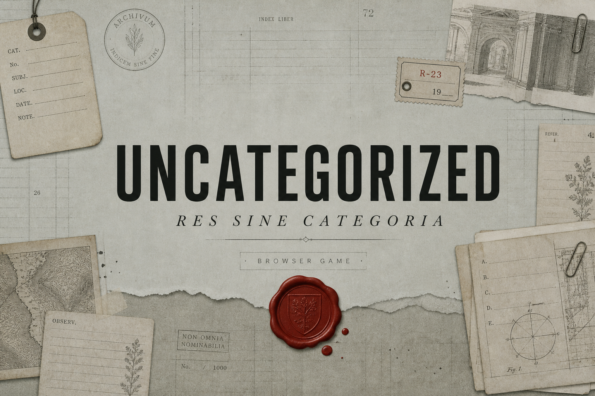

# UNCATEGORIZED

분류할 수 없는 개념을 조합하고 선포해, 세계를 유지하는 여덟 범주를 흔드는 단어 조합 로그라이크.

**[▶ 지금 플레이하기 · https://byabbbbi.github.io/UNCATEGORIZED/](https://byabbbbi.github.io/UNCATEGORIZED/)**



*RES SINE CATEGORIA*. 카드를 겹쳐 새 개념을 만들고 선택한 기둥에 선포한다. 누적된 선포로 신이 사임하면 해당 범주의 붕괴 규칙은 LLM 시스템 프롬프트에 영구히 추가된다. 세계 상태가 캐시 키와 생성 규칙에 함께 반영되므로, 같은 조합도 다른 세계에서는 다른 결과로 기록될 수 있는 구조.

데스크톱과 세로 모드 휴대폰(768px 미만)을 지원한다. 휴대폰에서는 하단 탭으로 기둥·연대기를 열고, 상단 `⋯` 메뉴에서 시대 마감과 정리를 실행한다.

## 조작

| 행동 | 실제 조작 |
| --- | --- |
| 조합 | 캔버스의 카드를 드래그해 다른 카드 위에 겹친다. 여러 조합을 동시에 처리할 수 있다. |
| 카드 복제 | 데스크톱에서는 더블클릭, 휴대폰에서는 400ms 길게 누르기. 같은 개념의 카드가 오른쪽 아래에 하나 더 생긴다. |
| 판례 대장 | 카드를 클릭하거나 탭한다. 하단 스트립에 부모 조합, 발견 당시 세계 상태, 파생 개념, 기둥·파괴력과 개념의 연대기가 고정 표시된다. |
| 대장 · CODEX | 데스크톱에서는 `Tab`, 휴대폰에서는 하단 서랍의 `전체 N` 버튼으로 연다. 검색·정렬 후 개념을 클릭하면 캔버스에 다시 놓인다. |
| 선포 | 데스크톱의 우측 패널 또는 휴대폰의 `기둥` 탭에서 대상을 고른 뒤 카드를 중앙 제단 `ARA`에 드래그한다. 시대당 최대 3회다. |
| 시대 마감 | 데스크톱에서는 캔버스 우측 상단, 휴대폰에서는 상단 `⋯` 메뉴의 `시대 마감`을 누른다. 사건을 정산하고 다음 시대로 넘어간다. |
| 분실물 보관소 | 하단의 보관소를 열고 파편 10개로 개념 하나를 회수한다. |
| 정리 | 데스크톱에서는 캔버스 상단, 휴대폰에서는 상단 `⋯` 메뉴의 `정리`를 눌러 흩어진 카드를 격자에 재배치한다. |

## 네 가지 시작 모드

| 모드 | 설명 |
| --- | --- |
| 처음부터 | 기본 원소 4개, 정합성 100, 안정도 100인 여덟 기둥으로 새 일반 세계를 연다. 기존 일반 런 저장은 지운다. |
| 이어하기 | 저장 버전 2의 일반 런이 있을 때만 표시된다. 개념·계보·사건 진행도와 세계 상태를 복원한다. |
| 붕괴된 세계에서 | 제4시대, 측정과 본질 기둥 붕괴, 「먼지」 오염 승격, 파편 10개인 고정 데모에서 시작한다. |
| 오늘의 세계 | KST 날짜를 시드로 시작 원소 4개, 초기 오염과 0~1개 붕괴 기둥을 정한다. 같은 날에는 같은 초기 세계와 사건 순서를 쓰며 일반 런과 별도로 저장한다. |

## 챌린지 기간(2026.08.04~08.26) 신규 개발 내역

현재 저장소의 커밋과 PR을 대조한 내역. 연속 기능 브랜치였던 PR #2~#5는 개별 PR을 닫은 뒤 해당 커밋을 `main`의 병합 커밋으로 통합했고, PR #6은 문서 작성 시점에 열려 있다.

| 기능 | PR/커밋 | Codex 작업 여부 |
| --- | --- | --- |
| 생성 품질·저장 기반 정비: 조어 필터와 리롤 1회, 하드테이블 406건, 런 저장·이어하기, 초반 배율, 띄어쓰기 지원 | [`642f8e4`](https://github.com/byabbbbi/UNCATEGORIZED/commit/642f8e4429971817ca14df7d425d7c020cdb196f) · [`30e5b23`](https://github.com/byabbbbi/UNCATEGORIZED/commit/30e5b23b928e8f0ea2064e3680bcf8eff25b219f) · [`67ca727`](https://github.com/byabbbbi/UNCATEGORIZED/commit/67ca7275f7348080f8b567c67869cec360b2ab80) | 예 (Codex 구현·검증) |
| 오늘의 세계: KST 날짜 시드, 결정적 초기 세계, 일일 저장 분리 | [PR #1](https://github.com/byabbbbi/UNCATEGORIZED/pull/1) · [`1ce14b3`](https://github.com/byabbbbi/UNCATEGORIZED/commit/1ce14b30ec7fd197dfa51f1b001996961ebc2281) | 예 (Codex 구현·검증) |
| 연대기 PNG 내보내기: Canvas 1080×1920 기록물, 폰트 대기, 긴 연대기 압축 | [PR #2](https://github.com/byabbbbi/UNCATEGORIZED/pull/2) · [`3a4eac3`](https://github.com/byabbbbi/UNCATEGORIZED/commit/3a4eac31d8daa437ab2e20708be279359e95e453) | 예 (Codex 구현·검증) |
| 조합 품질 개선 + 카드 복제: 오염 세계 하드테이블, concat 검출, 10자 제한, 더블클릭 복제 | [PR #3](https://github.com/byabbbbi/UNCATEGORIZED/pull/3) · [`ec3efcd`](https://github.com/byabbbbi/UNCATEGORIZED/commit/ec3efcdbbd7b9185b8a0711348fd009f9417da66) | 예 (Codex 구현·검증) |
| 카드 이모지 1개 제한: `Intl.Segmenter` 그래핌 정규화와 CSS 안전망 | [PR #4](https://github.com/byabbbbi/UNCATEGORIZED/pull/4) · [`0791b45`](https://github.com/byabbbbi/UNCATEGORIZED/commit/0791b4546a0ee9c072099c5f9a2f7a5098fbe5dd) | 예 (Codex 구현·검증) |
| 8기둥 복원: 관계·장소·상태·작용과 붕괴 규칙·대사·폴백·6/8 무구별 조건 | [PR #5](https://github.com/byabbbbi/UNCATEGORIZED/pull/5) · [`8f794c3`](https://github.com/byabbbbi/UNCATEGORIZED/commit/8f794c36299f27c25fdb25e95fa46e6d1045906d) | 예 (Codex 구현·검증) |
| 판례 대장 + 사건부: 조합 계보, 시대별 결정적 과제, 저장 버전 2 | [PR #6](https://github.com/byabbbbi/UNCATEGORIZED/pull/6) · [`8297aa7`](https://github.com/byabbbbi/UNCATEGORIZED/commit/8297aa7be803118f610fe5483351e26ee2acbdba) | 예 (Codex 구현·검증) |

### 기존 개발분

초기 조합 엔진, 4기둥 구조, 선포·붕괴·세 엔딩, 분실물 보관소, 기본 밸런스 수식과 분류 대장 UI는 2026년 8월 10일의 기존 해커톤 개발분이다. 시작점은 [`afe1173`](https://github.com/byabbbbi/UNCATEGORIZED/commit/afe1173276aa6e8e20727eb85778502ed3042b89)이며 위 신규 개발 표와 구분한다. 이번 기간의 작업은 저장·생성 품질 보강, 8기둥 원안 복원, 일일·계보·사건·내보내기 기능 확장.

## 기술 스택과 AI 구조

React 19, TypeScript 6, Vite 8, Zustand 5, Motion 13 기반 정적 SPA. 조합 결과는 `idb-keyval` 기반 IndexedDB에 캐시하고 런 진행은 `localStorage`에 저장한다. 효과음은 `zzfx`, 연대기 이미지는 외부 이미지 라이브러리 없는 Canvas API 방식이다. 런타임 LLM 호출은 클라이언트에 키를 두지 않고 프록시를 거치며, 모델과 호출 제한은 서버 측에서 강제된다.

생성은 실패를 다음 단계가 이어받는 5단 체인으로 구성된다.

1. **하드테이블 406건**: 붕괴 전 조합을 즉시 반환하고, 활성 오염이 있으면 결정적 30% 이름 후처리를 적용한다.
2. **IndexedDB 캐시**: 정렬된 조합쌍·붕괴 기둥·활성 오염이 같은 결과를 재사용한다.
3. **프리로드 JSON**: 배포 전에 준비한 조합 결과를 조회한다.
4. **프록시 경유 LLM**: 현행 세계 규칙을 넣은 시스템 프롬프트로 생성하고 부적절한 이름은 한 번만 다시 생성한다.
5. **LEXICON 로컬 폴백**: 네트워크·20초 타임아웃·파싱·품질 검사 실패를 결정적 생성으로 수습한다.

## Release Potential: Hive 확장 경로

게임 상태 저장과 판정은 모두 브라우저에서 처리한다. 게임 데이터 서버나 데이터베이스 없는 정적 배포이며, API 키 보호용 LLM 프록시만 게임 본체와 분리된 구조. 정적 호스팅의 고정 운영 비용은 사실상 0이다. LLM보다 먼저 조회하는 하드테이블 406건·IndexedDB 캐시·프리로드가 이미 알려진 조합과 반복 생성을 대부분 차단한다.

다음 단계는 현재 플레이를 유지한 채 서비스 계층을 얹는 방식이다.

1. **전역 조합 캐시**: 현재 브라우저마다 따로 저장하는 캐시를 서버로 옮기면 LLM 호출은 해당 세계 상태에서 아직 생성되지 않은 “세계 최초 조합”에만 필요해진다. 현행 캐시 키가 정렬된 조합쌍과 붕괴·오염 상태를 이미 포함하므로 키 형식을 그대로 이관할 수 있다.
2. **최초 발견 기록**: 전역 캐시에 결과를 처음 쓴 익명 식별자를 함께 보관해 “이 개념을 처음 만든 사람”을 기록한다. 계정이나 로그인 없이도 가능한 확장.
3. **일일 콘텐츠**: 날짜 시드 기반 `오늘의 세계`를 라이브 운영의 최소 단위로 삼는다. 서버가 붙으면 날짜별 플레이 통계·지난 세계 아카이브·결과 공유로 확장할 수 있고, 공유용 연대기 PNG는 이미 구현되어 있다.
4. **Hive 연동 지점**: 다음 단계에서 로그인·결제 없이 이용자 분석, 익명 식별과 일일 지표 수집에 연결한다. 게임 설계상 경쟁 랭킹은 추가하지 않고, 발견 기록과 연대기 중심의 비경쟁 공유 기능에 집중한다.

## 로컬 실행

Vite 8 기준 Node.js `20.19+` 또는 `22.12+`가 필요하다.

```bash
git clone https://github.com/byabbbbi/UNCATEGORIZED.git
cd UNCATEGORIZED
npm install
npm run dev
```

검증 명령:

```bash
npm run build
npm run validate:combos
```

## 문서

- [게임 가이드](docs/GAME_GUIDE.md): 규칙, 8기둥, 모드와 3분 관람 경로
- [AI 기술 문서](docs/AI_TECH.md): 생성 체인, 역할 경계, 붕괴 규칙과 프롬프트 전문
- [Codex 협업 기록](docs/CODEX_COLLABORATION.md): 제출 폼용 800자 요약과 상세 개발 기록
